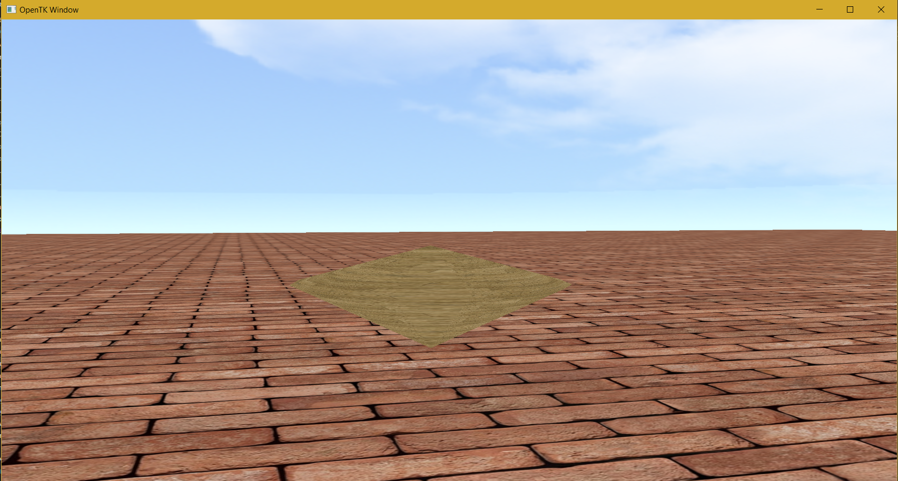

# UninaGame

A C# OpenTK project for 3D graphics experiments.



## Project Structure
- `Program.cs`: Entry point
- `game.cs`: Main game logic
- `Camera.cs`: Camera controls
- `Shader.cs`: Shader management
- `Shaders/`: GLSL shader files
- `Textures/`: Texture images

## Build & Run

```
dotnet build UninaGame.csproj
./bin/Debug/net8.0/UninaGame
```

## Requirements
- .NET 8.0 SDK
- OpenTK
